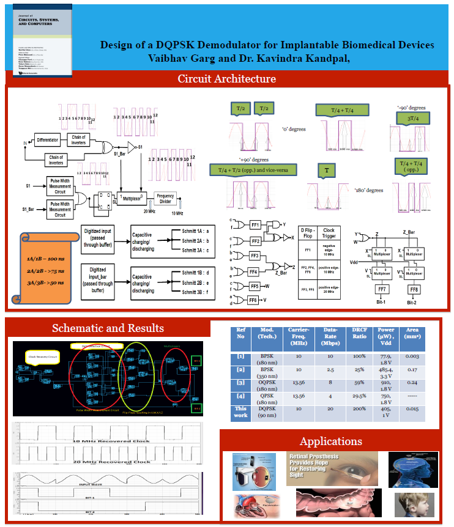
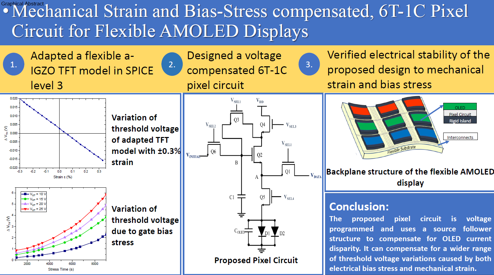

<h3><b>Sponsored Projects</b></h3>

  

    

    
      
    
    

  

    

<h3><b>Research Interests</b></h3>
 

 
<ol>
<li>Analog IC Design: Low power, high speed CMOS Operational Amplifier design, High speed comparators, current references and bandgap reference circuits design.</li>

<li>Mixed Signal Design: Sigma-Delta modulators, DQPSK demodulators, clocked comparators and filp-flops, memory circuit design</li>

<li>Oxide TFTs: Device modelling, transparent electronics, device fabrication, threshold voltage insensitive pixel driver circuitry design.</li>
</ol>
 

  <ol class="carousel-indicators">
    <li data-target="#carouselExampleIndicators" data-slide-to="0" class="active"></li>
    <li data-target="#carouselExampleIndicators" data-slide-to="1"></li>
  </ol>
  

    

      
    

    

      
    

  

  <a class="carousel-control-prev" href="#carouselExampleIndicators" role="button" data-slide="prev">
    
    Previous
  </a>
  <a class="carousel-control-next" href="#carouselExampleIndicators" role="button" data-slide="next">
    
    Next
  </a>

  